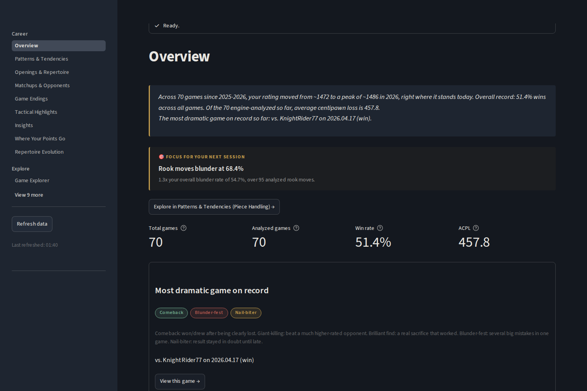
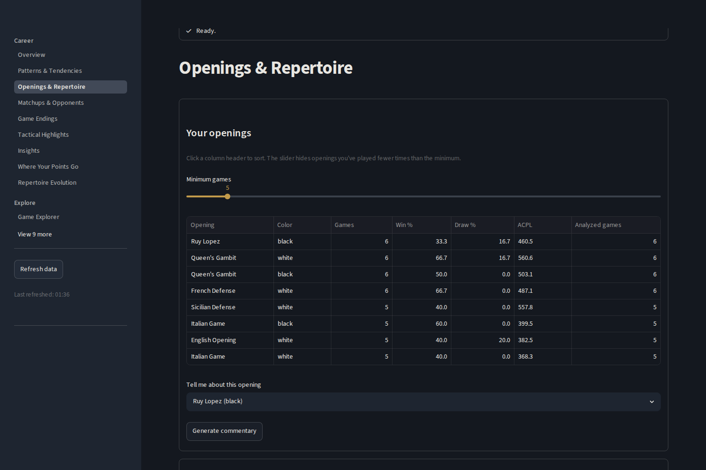
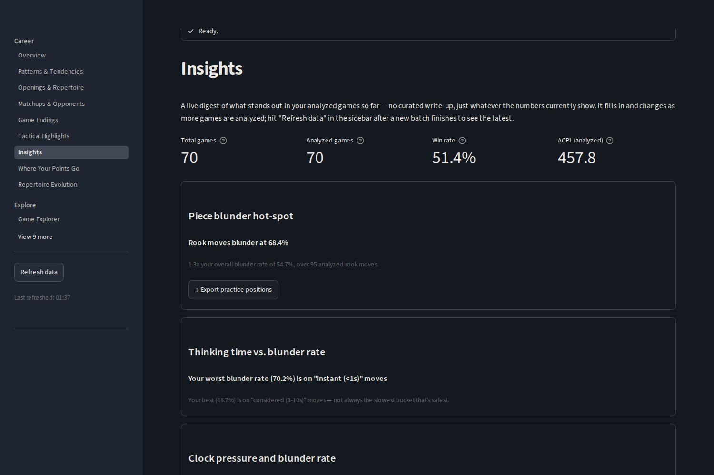
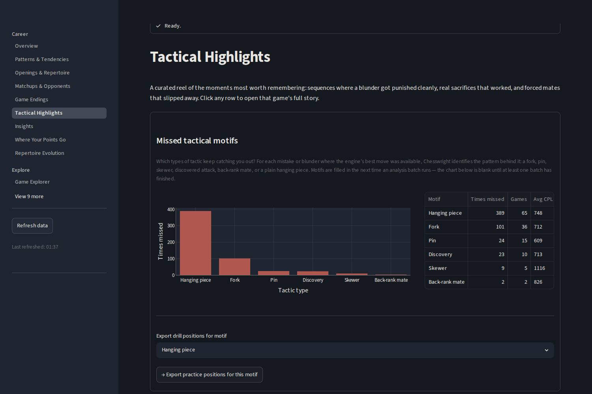
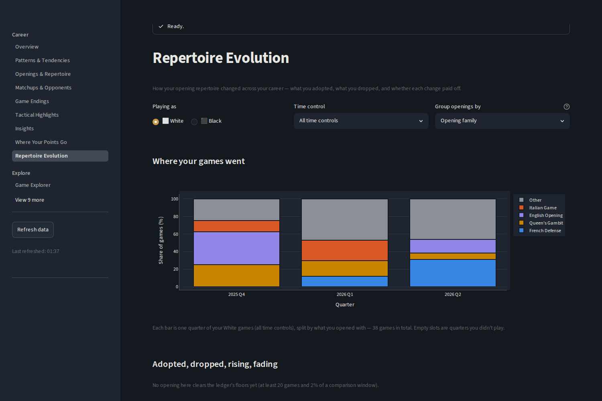

# Chesswright

Run real Stockfish-engine analysis of your own lichess games, on your own
computer. Chesswright finds patterns in how you actually play — openings,
time pressure, blunder rates, tactical highlights — the same way a chess
coach would, just powered by a real chess engine instead of a person.

**Everything stays on your machine.** Your games, your database, your
Stockfish install. Nothing is uploaded anywhere, and the only network
calls this app ever makes are to lichess's own public API (to fetch your
games) and, only if you choose to add your own key, Anthropic's API (for
optional AI-written commentary). There is no hosted/shared version of
this — it's a local install, period.

This is a **pilot build**. You're trying it early, before any general
release, which means: things may be rough, this doc is the only support
you'll get (no live walkthrough), and your honest feedback — what broke,
what confused you, how long things actually took — is the entire point
of you running it. Please report anything that goes wrong, even small
things.

## Screenshots

*Illustrative data — a synthetic game history generated for these
screenshots, not a real account.*

| | |
|---|---|
|  **Overview** — headline stats and the most dramatic game on record, first thing you see. |  **Openings & Repertoire** — win rate and accuracy by opening, per color. |
|  **Insights** — a live digest of what stands out in your analyzed games so far. |  **Tactical Highlights** — which tactical motifs keep catching you out. |
|  **Repertoire Evolution** — how your opening choices shifted over time, and whether the change paid off. | |

## Before you install: one honest thing up front

**Engine analysis is genuinely slow.** Stockfish has to actually
calculate every move of every game you analyze, and that takes real
time — there's no way around it. The app will measure this for real on
your own computer during setup and tell you an honest estimate before
you commit to anything. You don't have to wait for a full analysis to
get value — the dashboard works on whatever's been analyzed so far,
starting from your very first batch.

## 1. Install Stockfish first

Chesswright never bundles or auto-installs the chess engine itself (it's
a separate project, under its own license — see [Licensing](#licensing)
below). Install it yourself, before running Chesswright:

- **Windows**: download from [stockfishchess.org/download](https://stockfishchess.org/download/),
  unzip it, and remember where you put the `.exe`.
- **macOS**: `brew install stockfish` (if you have [Homebrew](https://brew.sh/)),
  or download a binary from the link above.
- **Linux**: `sudo apt install stockfish` (Debian/Ubuntu) or your
  distro's equivalent, or download from the link above.

Chesswright auto-detects a normal install. If it can't find one, the
setup wizard will tell you and let you point it at the file directly.

**Only use engine binaries from official sources.** If the wizard asks
you to browse for an engine file, use only a binary you downloaded
directly from [stockfishchess.org/download](https://stockfishchess.org/download/)
or the official release page of whichever UCI engine you're using.
Chesswright will execute the file you select — do not use a file from
an untrusted source.

## 2. Download Chesswright

Go to the [Releases page](https://github.com/Hawi254/chesswright/releases)
and download the zip for your operating system:

- `chesswright-windows.zip`
- `chesswright-macos.zip`
- `chesswright-linux.zip`

Unzip it anywhere you like (your Desktop, Documents, wherever).

## 3. Run it

### Windows

Open the unzipped folder and double-click `chesswright.exe`.

**You will very likely see a "Windows protected your PC" SmartScreen
warning.** This is expected — this build isn't code-signed yet (that
costs real money and isn't justified for a small pilot). Click **More
info**, then **Run anyway**. This is the same warning any small/new
Windows app shows before it's built up reputation with Microsoft; it is
not a sign that anything is actually wrong. If your antivirus quarantines
the file outright instead of just warning, please tell us — that's
useful pilot feedback, not something to just work around silently.

### macOS

Open the unzipped folder and double-click `chesswright`.

**macOS will almost certainly refuse to open it the first time**,
saying it's from an unidentified developer (same root cause as the
Windows warning above — this build isn't notarized/signed). To get past
this: **right-click (or Control-click) the `chesswright` app → Open**,
then confirm in the dialog that appears. After this first time, double-
clicking normally will work.

### Linux

Open a terminal in the unzipped folder and run:
```
./chesswright
```
If it doesn't start and you see something about missing GTK/WebKit
libraries, you'll need `python3-gi` and a WebKit2GTK package installed
via your distro's package manager (e.g. on Ubuntu/Debian:
`sudo apt install python3-gi gir1.2-webkit2-4.1`).

## 4. First-run setup

A window will open and walk you through setup:

1. **Your lichess username** — exactly as it appears in your profile URL.
2. **Stockfish detection** — confirms it found your install (or asks you
   to point at it).
3. **Fetching a few of your real games** — a small, fast download from
   lichess to use for the next step.
4. **Live timing calibration** — it actually analyzes a handful of your
   real moves, right then, on your computer, and times it. This is the
   real measurement the time estimate in the next step is based on.
5. **Pick a starter batch** — choose how many games to analyze first
   (a slider, with an honest minutes estimate based on what it just
   measured). You don't need to analyze your whole history up front.
6. It runs that batch, then hands you off to the actual dashboard.

After that, you can come back to **Setup** any time from the sidebar to
fetch more games and run another batch.

## Optional: your own Claude API key

Some extra features (richer per-game stories, opening/opponent
commentary) use Anthropic's Claude API. This is **entirely optional** —
everything else in the dashboard works without it. If you want it: get
your own API key from [console.anthropic.com](https://console.anthropic.com/),
then add it on the **Settings** page in the app. You pay Anthropic
directly for your own usage; Chesswright never sees or stores your key
anywhere except your own computer's secure credential store (or, as a
documented fallback if your system doesn't have one, a local file —
the Settings page will tell you plainly which one is in use).

**Shared computers:** if this machine has multiple user accounts, note
that without an OS keychain the fallback stores your key in a plain
text file (`~/.chesswright/api_key.txt`) that other users on the same
system could read. If this is a shared machine, either skip the API
key entirely or make sure an OS keychain is active before saving it.

## Where your data lives

Everything Chesswright creates — your database, your settings, your API
key (if you add one) — lives in a `.chesswright` folder in your user
home directory. Nothing is created or modified anywhere else on your
computer, and nothing is ever uploaded.

## Troubleshooting

- **"Could not find a Stockfish binary"** — see step 1 above. If you
  installed it somewhere unusual, the setup wizard lets you type the
  exact path.
- **Fetch step finds no games** — double-check your username is spelled
  exactly right (case-sensitive, no `@` prefix) and that the account has
  public rated games.
- **The app seems frozen during analysis** — it isn't; engine analysis
  is genuinely slow (see above) and the progress bar should be moving,
  even if slowly. If the progress bar itself hasn't moved in several
  minutes, that's a real bug — please report it.
- **Anything else** — please report it, including what you were doing,
  what you expected, and what happened instead. For this pilot, no
  detail is too small.

## Licensing

Chesswright's own code: MIT (see this repo). Stockfish is a separate
project under GPLv3 — Chesswright never bundles, modifies, or links
against it, which is exactly why you install it yourself in step 1.

## Support this project

Chesswright's core is free and stays free — this isn't a paywall. If
you'd like to support ongoing development anyway, you can do so via
[GitHub Sponsors](https://github.com/sponsors/Hawi254) or
[Open Collective](https://opencollective.com/chesswright).
